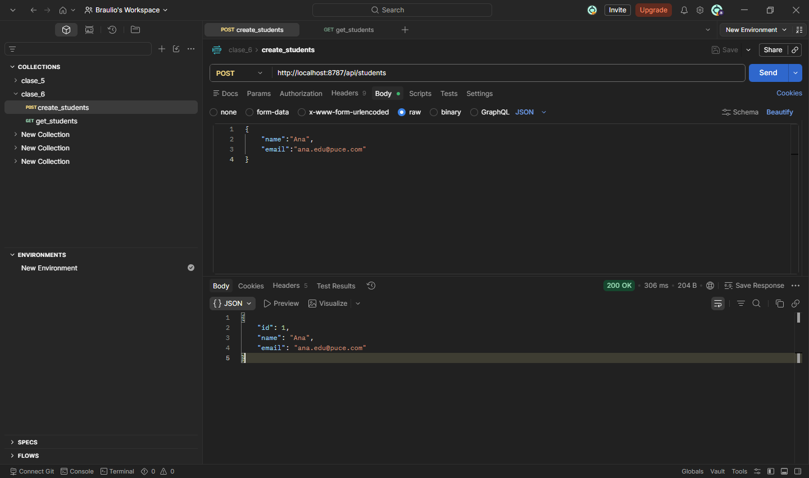
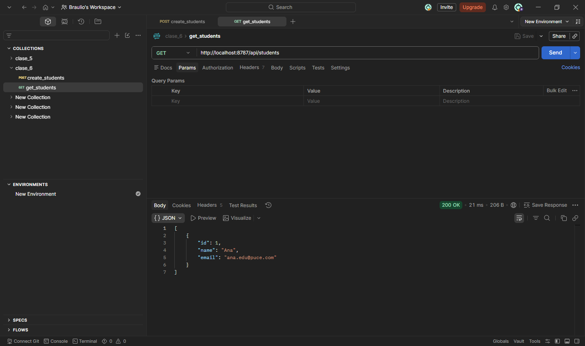

### Tarea_004: API REST de Estudiantes - Spring Boot + Kotlin
### 1. Registrar un Estudiante
**Método:** `POST`
**Ruta:** `http://localhost:8787/api/students`

### Evidencia de Prueba (POST)

### 2. Listar Todos los Estudiantes
**Método:** `GET`
**Ruta:** `http://localhost:8787/api/students`

### Evidencia de Prueba (GET)

