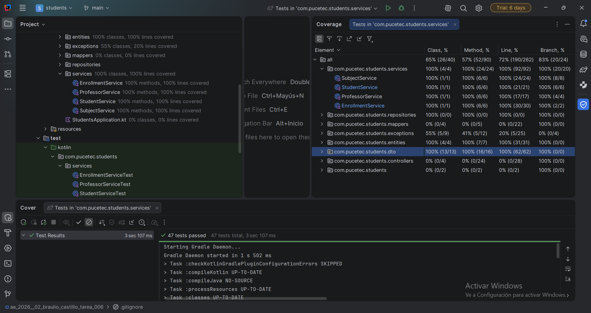

## Evidencia de Cobertura

A continuación se presenta el reporte de cobertura obtenido tras ejecutar `Run with Coverage` en el paquete `com.pucetec.students.services`.

### Reporte de cobertura del paquete `services`

> **Nota:** Se ha verificado que tanto el **Line %** como el **Branch %** alcancen el 100% en todas las clases de servicio.

## Estructura de Tests
Cada servicio cuenta con su propio archivo de prueba, cubriendo:
* **Camino feliz:** Casos de éxito con datos válidos.
* **Caminos de error:** Manejo de excepciones (`NotFound`, validaciones de campos en blanco, duplicados).
